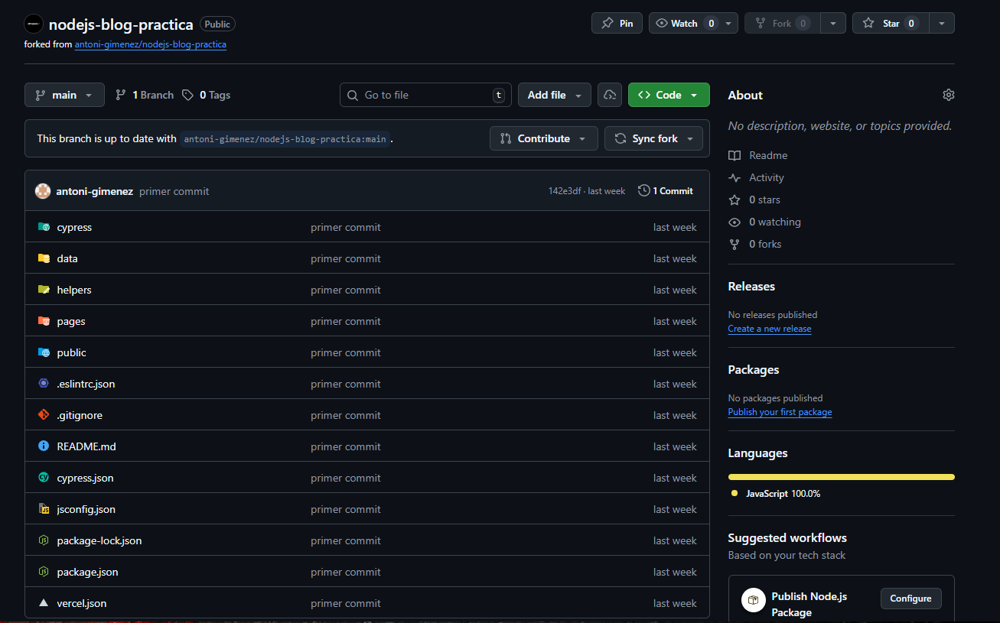

Example of nextjs project using Cypress.io

## RESULTADO DE LOS ÚLTIMOS TESTS

<!---Start place for the badge -->
[](https://www.cypress.io/)

<!---End place for the badge -->

# Introducción teórica

¿Que es GitHub Actions?

GitHub Actions es una plataforma de integración y despliegue continuo (CI/CD) integrada en GitHub que permite automatizar flujos de trabajo de forma sencilla y eficiente.

CI 
Prácitca de desarrollo donde los desarrolladores integran su código en un repositorio compartido. Cada integración es verificada con test automatizados para detectar errores rápidamente.

CD
Es una extensión de CI que asegura que el código siempre está en un listado para ser libreado en producción, tras pasar por purebas y validaciones automatizadas.

Componentes principales de GitHub Actions:

- Workflows: Flujo de trabajo automatizado definido en archvios yaml, que se ejecuta en respuestas a eventos específicos (push, pull request, etc). Y puede contener uno o más jobs.

- Jobs: Conjunto de pasos que se ejecutan en un entorno específico. Cada job puede depender de otros jobs y se ejecuta en paralelo o secuencialmente.

- Steps: Instrucciones individuales dentro de un job. Pueden ser comandos de shell o acciones reutilizables.

- Actions: Componentes reutilizables que realizan tareas específicas dentro de un step. Pueden ser creadas por la comunidad o desarrolladas internamente

- Runners: Servidor donde se ejecutan los jobs. GitHub proporciona runners hospedados, pero también se pueden configurar runners auto-hospedados.

Ventajas de usar GitHub Actions:
- Integración nativa con GitHub: Facilita la configuración y gestión de flujos de trabajo directamente desde el repositorio.
- Gran ecosistema de actions reutilizables en el GitHub Marketplace
- Flexibilidad para usar runners gestionados o propios.
- Sintaxis clara y declarativa en YAML.
- Ejecución en paralelo de jobs y steps.

# Pasos que he seguido

Hacemos un fork del repoositorio original



Clonamos el repositorio


Iniciamos git flow


Inicamos una feature para revisar los fallos del linter


Ejecutamos el linter, como podemos ver en la imagen hay varios errores


Corregimos los errores del linter


Comprobación de que el linter ya no da errores


Hacemos los commits y finalizamos la feature


Creamos la feature para empezar a crear los workflows de github actions


Creación de la carpeta .github/workflows


Creamos el primer workflow del linter´

```yaml
name: nodejs-blog-practica 

on: 
  push:
    branches:
      - main
      - feature/github-actions-workflow # Rama para hacer test del workflow

jobs:
  linter_job:
    runs-on: ubuntu-latest
    steps:
      - uses: actions/checkout@v5
      - uses: actions/setup-node@v6
        with:
          node-version: '18'
          cache: 'npm'
      - run: npm ci # npm install para desarrollo local y ci para entornos de CI/CD 
      - run: npm run lint
```

Hacemos commit y push de los cambios


Resultado del workflow en github actions


Creamo el segundo job para ejecutar los tests con cypress.io

```yaml
cypress_job:
    runs-on: ubuntu-latest
    needs: linter_job # Para que se ejecute despues del job del linter
    steps: 
      - uses: actions/checkout@v5
      - uses: actions/setup-node@v6
        with:
          node-version: '18'
          cache: 'npm'
      - run: npm ci
      - name: Checkout Cypress
        uses: cypress-io/github-action@v5
        continue-on-error: true # para que continue aunque de algún error
        with:
          start: npm start
          wait-on: 'http://localhost:3000'
      - name: Guardar resultado test
        run: |
          if [ $? -eq 0 ]; then
            echo "success" > result.txt
          else
            echo "failure" > result.txt
          fi
      - name: Subir resultado artifact
        uses: actions/upload-artifact@v4
        with:
          name: cypress-test-result
          path: result.txt
```

Hacemos commit y push de los cambios


Exito 


Comprobación del artifact


Continuamos con el job de badge

```yaml
add_badge_job:
    runs-on: ubuntu-latest
    needs: cypress_job
    steps:
      - name: Checkout del código
        uses: actions/checkout@v5
      - name: Descargar resultado artifact
        uses: actions/download-artifact@v4
        with:
          name: cypress-test-result
      - name: Leer resultado test
        id: cypress-output
        run: echo "::set-output name=cypress_outcome::$(cat result.txt)"
      - name: Actualizar README con badge
        uses: ./.github/actions/add-badge
        with:
          cypress_outcome: ${{ steps.cypress-output.outputs.cypress_outcome }}
      - name: Hacer commit y push del README actualizado
        run: |
          git config --global user.name 'github-actions[bot]'
          git config --global user.email 'github-actions[bot]@users.noreply.github.com'
          git add README.md
          if git diff --cached --quiet; then
            echo "No changes to commit"
          else
            git commit -m "Actualizar badge de resultados de tests de Cypress - ${{ steps.cypress-output.outputs.cypress_outcome }}"
            git push
          fi
```

Creación del action

```yaml
name: Añadir badge al README
inputs:
  cypress_outcome:
    description: 'Resultado de los tests de Cypress (success o failure)'
    required: true
    default: 'failure'  
runs:
  using: 'composite'
  steps:
    - name: Añadir badge al README
      shell: bash
      run: |
        echo "Cypress outcome: ${{ inputs.cypress_outcome }}"

        if [ "${{ inputs.cypress_outcome }}" = "success" ]; then
          BADGE_URL="https://img.shields.io/badge/tested%20with-Cypress-04C38E.svg"
        else
          BADGE_URL="https://img.shields.io/badge/test-failure-red"
        fi

        # Crear sección de badge al README si no existe
        if ! grep -q "RESULTAT DE LOS ÚLTIMOS TESTS" README.md; then
          echo -e "\n## RESULTAT DE LOS ÚLTIMOS TESTS\n" >> README.md
          echo "" >> README.md
        else
          sed -i "/RESULTAT DE LOS ÚLTIMOS TESTS/{n; s|https://img.shields.io/badge[^)]*|$BADGE_URL|;}" README.md
        fi
```

Exito


Creamos el siguiente job. Para ello vamos a la documentación del action y vemos los inputs necesarios


Leemos mas documentación para ver cosas necesarias


Ahora vamos a inicar sessión en vercel y crear un token


Instalamos vercel globalmente en nuestro ordenador


Hacemos el login con vercel en nuestro equipo


Login exitoso


Creamos el token


Añadimos el secret en github


Conectamos tambien GitHub con Vercel


Añadimos el proyecto 


Conectamos el repositorio


Sacamos los otros dos ID necesarios


Ponemos los ID en github secrets    


Ahora creamos la action
```yaml
deploy_job:
    runs-on: ubuntu-latest
    needs: cypress_job
    steps:
      - name: Checkout del código
        uses: actions/checkout@v5
      - name: Desplegar en vercel
        uses: amondnet/vercel-action@v20
        with:
          vercel-token: ${{ secrets.VERCEL_TOKEN }}
          vercel-project-id: ${{ secrets.VERCEL_PROJECT_ID }}
          vercel-org-id: ${{ secrets.VERCEL_ORG_ID }}
```

Hacemos un push


Exito en el deploy


Deployments de vercel


Vemos la web funcionando 


Creación del action del email

Creamos las carpetas


Para poder usar nodemail con email necestiamos accer los siguientes pasos

Activamos la autenticación en 2 pasos


En app passwords creamos generamos la password 


Añadimos el secret en github


Creamos el workflow

```yaml
notification_job:
    runs-on: ubuntu-latest
    needs: [linter_job, cypress_job, add_badge_job, deploy_job]
    if: always()
    steps:
      - name: Checkout del código
        uses: actions/checkout@v5
      - name: Node
        uses: actions/setup-node@v6
        with:
          node-version: '18'
          cache: 'npm'
      - name: Instalar dependencias
        run: |
          cd .github/actions/send-email
          npm install
      - name: Enviar email
        uses: ./.github/actions/send-email
        with:
          usuario_email: 'jordivallspladaw@gmail.com'
          resultado_workflow: |
            Linter: ${{ needs.linter_job.result }}
            Cypress: ${{ needs.cypress_job.result }}
            Add Badge: ${{ needs.add_badge_job.result }}
            Deploy: ${{ needs.deploy_job.result }}
          GMAIL_TOKEN_USER: ${{ secrets.GMAIL_USUARIO }}
          GMAIL_TOKEN: ${{ secrets.GMAIL_TOKEN }}
```

El action del email

```yaml
name: Send Email
description: 'Send email'
inputs:
  usuario_email:
    description: 'Recipient email address'
    required: true
    default: 'jordivallspladaw@gmail.com'
  resultado_workflow:
    description: 'Resultado del workflow'
    required: true
  GMAIL_TOKEN_USER:
    description: 'Email user'
    required: true
  GMAIL_TOKEN:
    description: 'Email token'
    required: true

runs:
  using: 'node16'
  main: 'index.js'
```

index.js
```javascript
const nodeMailer = require('nodemailer');


const enviador = nodeMailer.createTransport({
    service: 'gmail',
    auth: {
        user: process.env.INPUT_GMAIL_TOKEN_USER,
        pass: process.env.INPUT_GMAIL_TOKEN,
    },
});

async function enviar() {
    const resultado = process.env.INPUT_RESULTADO_WORKFLOW ;

    const htmlBody = `
        <p>S'ha realitzat un push en la branca main que ha provocat l'execució del workflow nodejs-blog-practica amb els següents resultats:</p>
        <ul>${resultado}</ul>
    `;

    await enviador.sendMail({
        from: process.env.INPUT_GMAIL_TOKEN_USER,
        to: process.env.INPUT_GMAIL_TOKEN_USER,
        subject: 'Resultat del workflow executat',
        html: htmlBody,
    });
}

enviar().then(() => {
    console.log('Email enviat correctament');
}).catch((error) => {
    console.error('Error en enviar l\'email:', error);
});
```

Workflow completo
```yaml
name: nodejs-blog-practica 

on: 
  push:
    branches:
      - main
      # - feature/github-actions-workflow # Rama para hacer test del workflow

jobs:
  linter_job:
    runs-on: ubuntu-latest
    steps:
      - uses: actions/checkout@v5
      - uses: actions/setup-node@v6
        with:
          node-version: '18'
          cache: 'npm'
      - run: npm ci # npm install para desarrollo local y ci para entornos de CI/CD 
      - run: npm run lint
  cypress_job:
    runs-on: ubuntu-latest
    needs: linter_job
    steps:
      - uses: actions/checkout@v5
      - uses: actions/setup-node@v6
        with:
          node-version: '18'
          cache: 'npm'
      - run: npm ci
      - name: Checkout Cypress
        uses: cypress-io/github-action@v5
        continue-on-error: true
        with:
          start: npm start
          wait-on: 'http://localhost:3000'
      - name: Guardar resultado test
        run: |
          if [ $? -eq 0 ]; then
            echo "success" > result.txt
          else
            echo "failure" > result.txt
          fi
      - name: Subir resultado artifact
        uses: actions/upload-artifact@v4
        with:
          name: cypress-test-result
          path: result.txt
  add_badge_job:
    runs-on: ubuntu-latest
    needs: cypress_job
    steps:
      - name: Checkout del código
        uses: actions/checkout@v5
      - name: Descargar resultado artifact
        uses: actions/download-artifact@v4
        with:
          name: cypress-test-result
      - name: Leer resultado test
        id: cypress-output
        run: echo "::set-output name=cypress_outcome::$(cat result.txt)"
      - name: Actualizar README con badge
        uses: ./.github/actions/add-badge
        with:
          cypress_outcome: ${{ steps.cypress-output.outputs.cypress_outcome }}
      - name: Hacer commit y push del README actualizado
        run: |
          git config --global user.name 'github-actions[bot]'
          git config --global user.email 'github-actions[bot]@users.noreply.github.com'
          git add README.md
          if git diff --cached --quiet; then
            echo "No changes to commit"
          else
            git commit -m "Actualizar badge de resultados de tests de Cypress - ${{ steps.cypress-output.outputs.cypress_outcome }}"
            git push
          fi
  deploy_job:
    runs-on: ubuntu-latest
    needs: cypress_job
    steps:
      - name: Checkout del código
        uses: actions/checkout@v5
      - name: Desplegar en vercel
        uses: amondnet/vercel-action@v20
        with:
          vercel-token: ${{ secrets.VERCEL_TOKEN }}
          vercel-project-id: ${{ secrets.VERCEL_PROJECT_ID }}
          vercel-org-id: ${{ secrets.VERCEL_ORG_ID }}
  notification_job:
    runs-on: ubuntu-latest
    needs: [linter_job, cypress_job, add_badge_job, deploy_job]
    if: always()
    steps:
      - name: Checkout del código
        uses: actions/checkout@v5
      - name: Node
        uses: actions/setup-node@v6
        with:
          node-version: '18'
          cache: 'npm'
      - name: Instalar dependencias
        run: |
          cd .github/actions/send-email
          npm install
      - name: Enviar email
        uses: ./.github/actions/send-email
        with:
          usuario_email: 'jordivallspladaw@gmail.com'
          resultado_workflow: |
            Linter: ${{ needs.linter_job.result }}
            Cypress: ${{ needs.cypress_job.result }}
            Add Badge: ${{ needs.add_badge_job.result }}
            Deploy: ${{ needs.deploy_job.result }}
          GMAIL_TOKEN_USER: ${{ secrets.GMAIL_USUARIO }}
          GMAIL_TOKEN: ${{ secrets.GMAIL_TOKEN }}
```

Hacemos un push para ejecutar todo el workflow y recibimos el email


Finalizamos la feature


Creamos y cerramos release


Hacemos un push


Se ejecuta el job, ahora solo al hacer push a la rama main


Exito en los jobs


Recibimos el email


# Pasos a seguir para el profile

Clonamos el repositorio del profile


Genramos un token


Al crear el token seleccionamos los permisos necesarios


Estos permisos los sacamos de la documentación del action donde estan los pasos a seguir


Añadimos el token a los secrets de github


Añadimos el workflow, la documentación nos da un ejemplo

```yaml
name: Metrics
on:
  # Schedule daily updates
  schedule: [{cron: "0 0 * * *"}]
  # (optional) Run workflow manually
  workflow_dispatch:
  # (optional) Run workflow when pushing on master/main
  push: {branches: ["master", "main"]}
jobs:
  github-metrics:
    runs-on: ubuntu-latest
    environment: 
      name: production
    permissions:
      contents: write
    steps:
      - uses: lowlighter/metrics@latest
        with:
          token: ${{ secrets.METRICS_TOKEN }}
          user: idrojone
          output: "readme"
          filename: "github-metrics.svg"
          base: "header, activity, community, repositories, metadata"
          config_timezone: Europe/Madrid
          plugin_languages: true
          plugin_languages_details: percentage
          plugin_languages_colors: github
          plugin_languages_threshold: 0%
```

en el archivo readme tenemos que añadir esta linea para que funcione, porque el workflow añade una imagen svg al readme

```markdown 

```

Al hacer push y ejecutarse el workflow vemos que funciona


